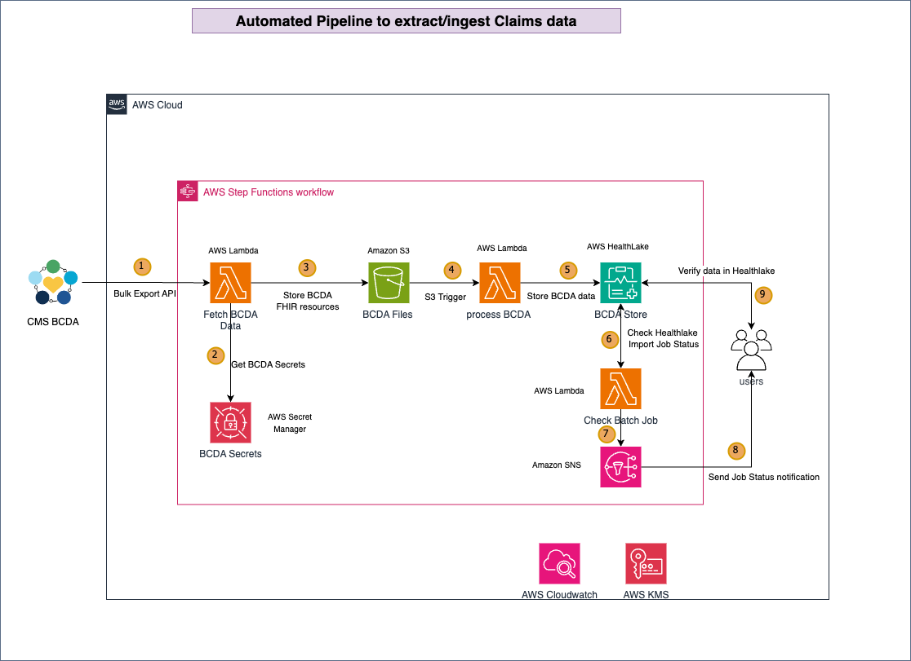

# Beneficiary Claims Data API (BCDA) Claims Data extraction and Ingestion with AWS HealthLake

The [Beneficiary Claims Data API](https://bcda.cms.gov/guide.html) (BCDA) is an Application Programming Interface (API) that enables model entities – Accountable Care Organizations (ACO), Direct Contracting Entities (DCE), Kidney Care Entities (KCE), and Kidney Care First (KCF) Entities – to retrieve Medicare claims data for their beneficiaries. CMS uses BCDA to serve as a direct pipeline to provide claims data in more timely manner. BCDA uses the [FHIR Bulk Export Specification](https://www.hl7.org/fhir/uv/bulkdata/export.html) to provide claims data in the ndjson format for five FHIR ResourceTypes - ExplanationOfBenefit, Patient, Coverage, Claim and Claim Response. The frist three are just for adjudcated claims and the last two are use for partial claims. BCDA v2 follows R4 and CARIN Blue Button specifications for Bulk Export which validates incoming data based on IG specifications.

[AWS HealthLake](https://docs.aws.amazon.com/healthlake/latest/devguide/what-is-amazon-health-lake.html) serving as the R4 FHIR Server, supports Bulk Export and Import conformant with CARIN Blue Button 1.0 and 1.1 IGs. Customers can retrieve Medicare claims data from CMS’s BCDA, import it in HealthLake and make then interact with the data using both FHIR APIs transactionally and also for Analytics use-cases for their beneficiaries.

In order to make it easier for customers to fetch, store and transact on Claims data that CMS makes available on an on-going basis, AWS SAM deploys the relevant services in a customer account to automate the extraction of Claims data periodically from BCDA and hydrate HealthLake once those files are fetched.

## Design



The workflow steps:

1. The User logs in the AWS Console and opens Amazon Step Functions workflow and navigates to state machine on left side menu and chooses BCDAToHealthLakeStateMachine.Once on the workflow page select start execution button to start BCDA extract/ingestion workflow.
2. Fetch BCDA Data Lambda will authenticate with BCDA data source using secrets from AWS Secret Manager and start extracting data from BCDA.
3. FetchBCDAData Lambda is storing data to S3 in NDJSON format. 
4. As soon as files are uploaded to S3 trigger invokes process BCDA Data Lambda. 
5. Process BCDA Data lambda invokes import jobs feature to store BCDA data into Healthlake. 
6. Check BCDA Job continuously check status of Healthlake Import Job and send notifications based on outcome. 
6. Check BCDA Job sends notification to users using Amazon SNS(Simple Notification service).
8. Amazon SNS send notification to users.
9. User can now verify BCDA claims data in the HealthLake.


## Installation
### Prerequisites
1. [AWS SAM](https://docs.aws.amazon.com/serverless-application-model/latest/developerguide/serverless-sam-cli-install.html)
2. Python 3.11
3. AWS Healthlake Datastore is already created.
4. BCDA Credentials (client_id and client_secret) stored in secret manager
     Please follow below steps to store credentials 
	    a. In AWS Secrets Manager, Click on "Store a new secret"
    	b. Under "Secret Type", choose "Other type of secret".
    	c. You should see key/value pairs under, enter "client_id" as the first key and "client_secret" as the second key.
    	d. Give both the keys their respective values, and click "Next"
    	e. Give your secret a meaningful name.
    	f. Click "Next", and "Next" once more, Then click "Store"
3. KMS key used to create datastore is already created.
4. Role with permissions for the cloudformation template already created (see instructions below)


### Deploying the solution

1. Clone the repository and navigate to the solution directory:

```sh
git clone git@ssh.gitlab.aws.dev:manishpl/aws-bcda-bulk-export-api.git
cd aws-bcda-bulk-export-api.git/
```

2. Build the application using following command:

```sh
sam build
```

3. Deploy the application using the guided process below:

```sh
sam deploy --guided
# Replace MY_VALUE and MY_ACCOUNT_ID with proper resource names
Configuring SAM deploy
======================

Looking for config file [samconfig.toml] :  Not found
    Setting default arguments for 'sam deploy'
    =========================================
    Stack Name [bcda]: BCDA Export Pipeline
    AWS Region [us-west-2]: us-west-2
    Parameter KMSKeyId [kms-key-id]: Enter KMS Key id for Healthlake if not leave it blank
    Parameter HealthLakeDataStoreId [datastore-id]]: your data store id
    Parameter BCDAV2DataS3BucketName [bucket-name]: your bucket name
    Parameter HealthLakeImportJobOutputS3BucketName [bucket-name]: your job output bucket name
    Parameter CredentialsSecretName [credentials-secret-name]: your secret name where BCDA credentials are stored
    Parameter NotificationEmail [email@example.com]: your email
    #Shows you resources changes to be deployed and require a 'Y' to initiate deploy
    Confirm changes before deploy [y/N]: y
    #SAM needs permission to be able to create roles to connect to the resources in your template
    Allow SAM CLI IAM role creation [Y/n]:Y 
    #Preserves the state of previously provisioned resources when an operation fails
    Disable rollback [y/N]: N
    Save arguments to configuration file [Y/n]: Y
```

Once deployment is completed you will see SAM output with ARN of Step function workflow.

## Post Deployment Steps

### Execute BCDA Claims extraction/ingestion workflow

BCDA Claims extraction/ingestion process is deployed as AWS Step Functions workflow.In order to start process please follow steps as mentioned below:

1. Navigate to AWS Step functions workflow in the AWS Console. Once on the Step Functions homepage , click on State Machine on the left side menu.

2. You will see state machine was created as part of SAM deployment. 

3. Navigate to your State Machine and click on Start Execution button as shown below
    
	

4. You will popup window that will ask you to enter input however as we are running this as batch no worfklow input is required, Please click on Start Execution button.You will be below screen which indicates execution is in progress

	

5. Depending on the size of data from the source, execution will take couple of minutes. You will see below screen once execution is completed.

	

6. You should also receive email with the status of the Job.

7. Once Job is complete , Navigate to AWS Healthlake and verify data. 
